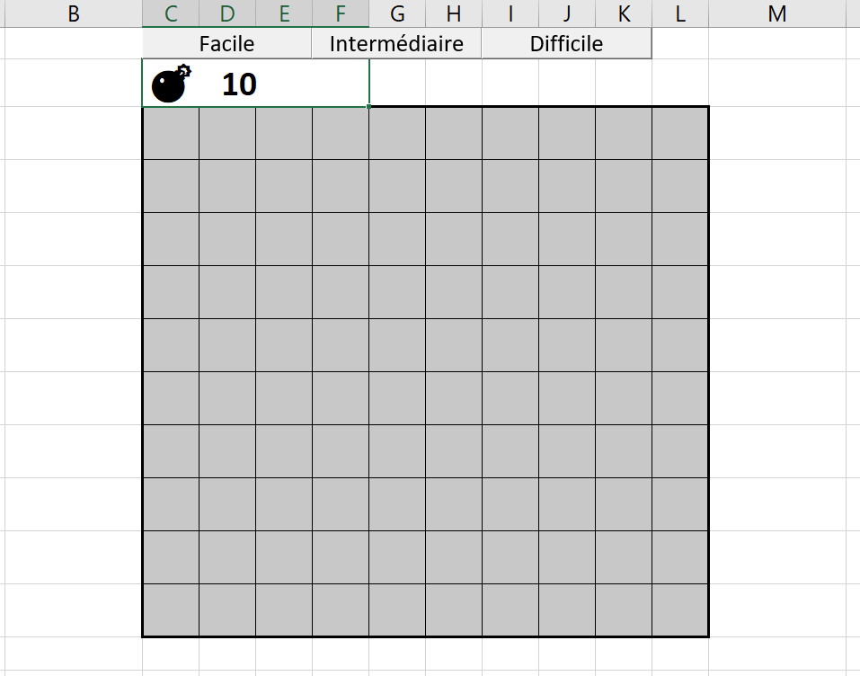
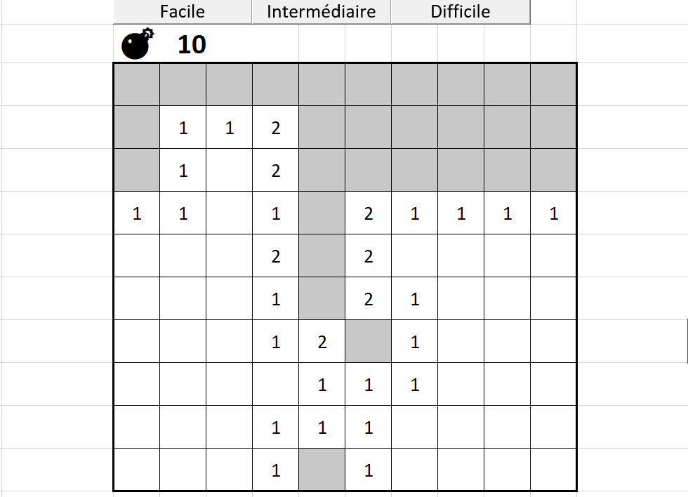
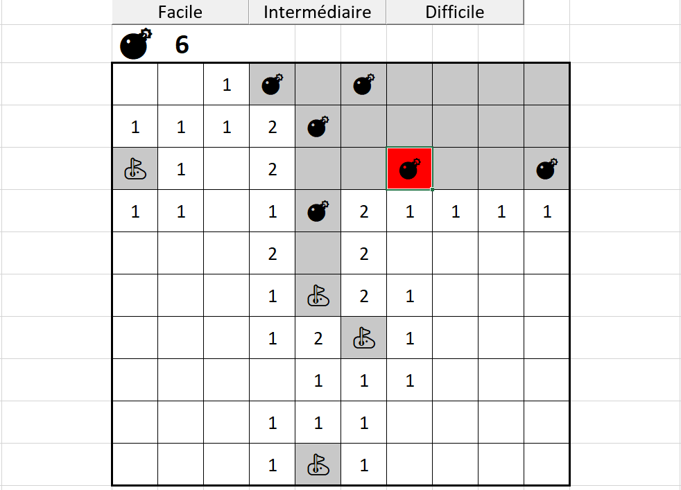

# Minesweeper game in Excel
Reproduction of the minesweeper game in excel.

## Presentation
You can import the files directly into Excel.  
Once this is done all you have to do is run the macro 'ConfigureWorksheet'.  
You can add a button linked to the macro or run it from the list of macros.  

## Start to play
3 buttons allow you to choose the difficulty : 
- Facile (=easy) | 10 mines
- Intermédiaire (=medium) | 40 mines
- Difficile (=hard) | 100 mines  

### New game

### Uncover cells

### Game lost
